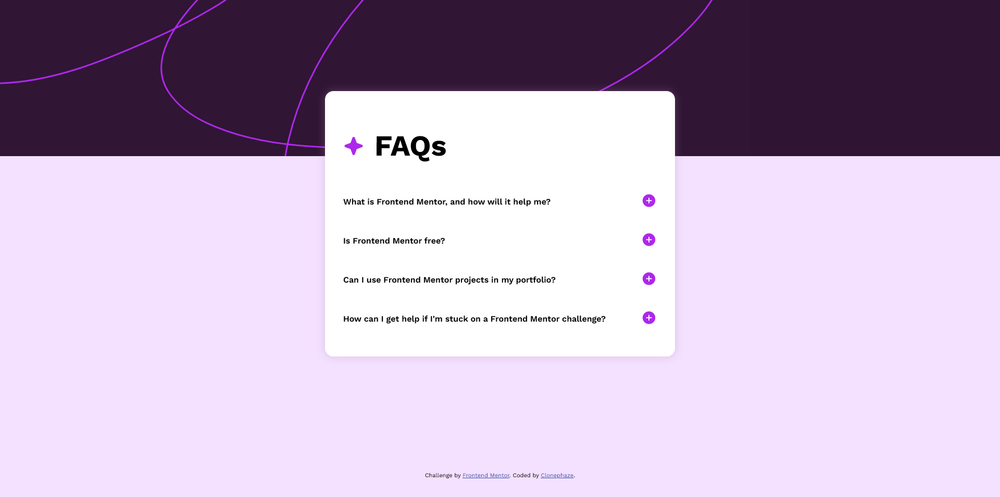

# Frontend Mentor - FAQ accordion solution

This is a solution to the [FAQ accordion challenge on Frontend Mentor](https://www.frontendmentor.io/challenges/faq-accordion-wyfFdeBwBz). Frontend Mentor challenges help you improve your coding skills by building realistic projects. 

## Table of contents

- [Frontend Mentor - FAQ accordion solution](#frontend-mentor---faq-accordion-solution)
  - [Table of contents](#table-of-contents)
  - [Overview](#overview)
    - [The challenge](#the-challenge)
    - [Screenshot](#screenshot)
    - [Links](#links)
  - [My process](#my-process)
    - [Built with](#built-with)
    - [What I learned](#what-i-learned)
    - [Continued development](#continued-development)
    - [Useful resources](#useful-resources)
  - [Author](#author)

## Overview

### The challenge

Users should be able to:

- Hide/Show the answer to a question when the question is clicked
- Navigate the questions and hide/show answers using keyboard navigation alone
- View the optimal layout for the interface depending on their device's screen size
- See hover and focus states for all interactive elements on the page

### Screenshot

### Links

- Solution URL: [GitHub](https://github.com/Clonephaze/faq-accordion-main)
- Live Site URL: [Github Pages](https://clonephaze.github.io/faq-accordion-main/)

## My process

### Built with

- Semantic HTML5 markup
- CSS custom properties
- Flexbox
- Mobile-friendly design

### What I learned

Learned how to make accordion menus that not only transition smoothly but also be keyboard accessible.

### Continued development

I want to keep learning how to do these things even faster than before.

### Useful resources

- [Mozilla Developer Network](https://developer.mozilla.org) - Good to have a basic reference for html and css

## Author

- Website - [Clonephaze](https://github.com/Clonephaze)
- Frontend Mentor - [@Clonephaze](https://www.frontendmentor.io/profile/clonephaze)
